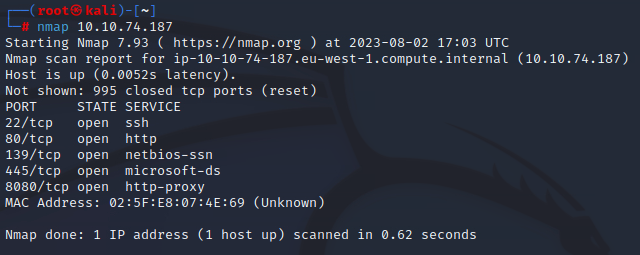

# Walkthrough for the TryHackMe NetSec module challenge
# [Click here to navigate to the module](https://tryhackme.com/module/network-security)

## What is the highest port number being open less than 10,000?

Launching conventional nmap scan will to the trick.

**Answer: 8080**

## There is an open port outside the common 1000 ports; it is above 10,000. What is it?

Since question is hiding a small clue that the port will be above common 1000 ports we would need to utilize option **-p-** to scan all ports.

******Answer: 10021******

## How many TCP ports are open?

Counting all TCP’s from previous question will bring us to the right answer.

******Answer: 6******

## What is the flag hidden in the HTTP server header?

First we need to determine the HTTP service version by utilizing **-sV** option - to be as closest as possible ive used the **—version-intensity 9** - we can also narrow the scan to avoid cryptic-output to the specific port with **-p** option. 

### **Ok version acquired, now we have three options:**

**1.Use CLI way and obtain the flag by hand:**

**2.Utilize nmap scripting engine to run the specified header grabber for HTTP:**

**3.Or use web-browser to inspect network section of the page**

**Answer:** **THM{web_server_25352}**

## What is the flag hidden in the SSH server header?

We can easily utilize **telnet** to grab the banner in this case.

**Answer: THM{946219583339}**

## We have an FTP server listening on a nonstandard port. What is the version of the FTP server?

Since the question is pointing us to the non-standard port lets examine the one which is beyond-standard, we will use the **-sV** option and narrow the scan only to the specific port with option **-p**.

**Answer: vsftpd 3.0.3**

## We learned two usernames using social engineering: eddie and quinn. What is the flag hidden in one of these two account files and accessible via FTP?

As the question suggest’s we should obtain password’s to both accounts but first verify if we really need the password’s:

Yup, both account’s require password.

We can utilize **Hydra** in attempt to brute-force both password’s using wordlist f.e **rockyou.txt** -note that FTP is running on non-standard port 10021 so we need to specify it with **-s 10021** - by default Hydra is looking to enumerate FTP target on **port 21**.

Okay we have both passwords: **jordan** and **andrea** we can use FTP to connect to both accounts and grab the flag.

Looks like **eddie** has empty pockets, lets try **quinn**.

Success, quinn has the flag, using the FTP command get to download the file we can examine its content.

**Answer: THM{321452667098}**

## Browsing to http://10.10.74.187:8080 displays a small challenge that will give you a flag once you solve it. What is the flag?

Lets navigate to the page first and see what is this all about.

Clearly the page is suggesting to perform and **“stealth scan”** to avoid FW and IDS. Lets fire up the most used **-sS** aka stealth scan and see the score:

This didnt worked well, lets restart the counter and try another ones, lets use null scan:

As the documentation suggests:

**Null scan does not send any flag at all, it is an un-usuall packet for the FW and IDS and it can potentionally bypass the security measurements (promises, promises).** 

**Answer: THM{f7443f99}**

Hope u liked the challenge 